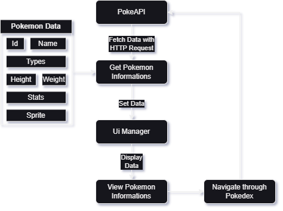

# Pokemon Pokedex

This is a simple Pokemon Pokedex application that allows you to access information about various Pokemon through the PokeAPI. It is built using Unity and showcases the following functionalities:

## Functionalities

1. **View Pokemon Information**: The Pokedex enables you to view detailed information about various Pokemon, including their names, types, stats, and images.

2. **Navigation**: You can navigate through the list of Pokemon to see their details. Use the "Next" and "Previous" buttons to move forward and backward in the list.

3. **Artwork Display**: The Pokedex displays official artwork of each Pokemon, giving you a visual representation of your favorite creatures.

4. **Efficient HTTP Requests**: The Pokedex efficiently makes use of HTTPS requests to the PokeAPI to retrieve and display Pokemon information. It employs asynchronous requests, allowing you to continue using the Pokedex while data is being fetched in the background.

## How It Uses HTTPS Requests

The Pokedex uses the Unity `UnityWebRequest` class to make asynchronous HTTPS requests to the [PokeAPI](https://pokeapi.co/). When you access the details of a Pokemon, the following steps occur:

1. The Pokedex sends a request to the PokeAPI for information about the specified Pokemon.

2. The PokeAPI responds with the requested data, including the name, types, stats, and URLs for the official artwork of the Pokemon.

3. The Pokedex efficiently processes the data, displaying the Pokemon's name, types, and stats, and then retrieves and displays the official artwork from the provided URL.

This approach ensures that the Pokedex continues to be responsive and provides a seamless experience while fetching Pokemon information from the PokeAPI.

## Architecture

   

---

**Note**: Make sure you have an internet connection while using the Pokedex to fetch data from the PokeAPI.

Feel free to explore, modify, and enhance the Pokedex as needed for your own projects.
